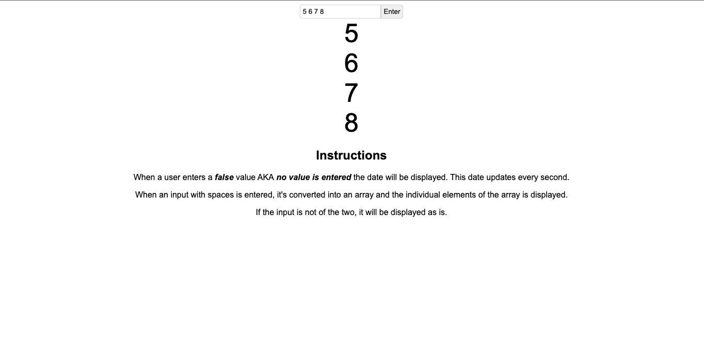
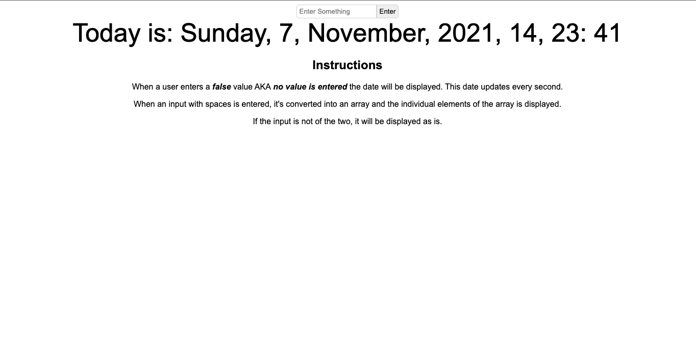
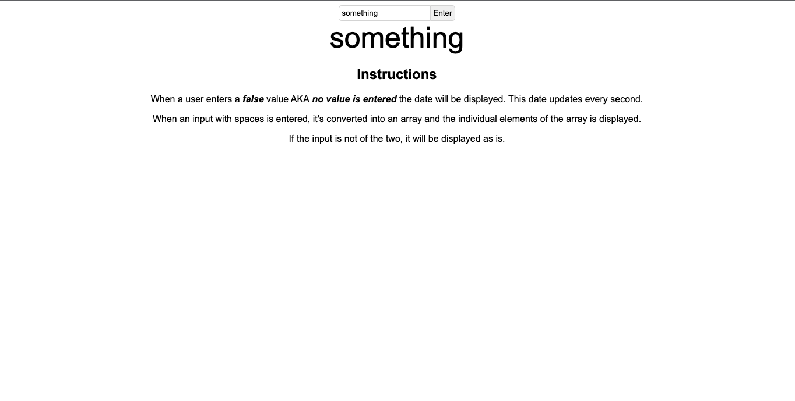

# Opareta Software Engineer Interview Question.

> A Simple Web App built in React that displays a different output depending on the Users Input.

> The View if the user enters an array.

> The View if the user enters a False input.

> The View if the user enters anything else.


## Built With

- JSX, CSS
- React, Redux

# Set Up
## Clone This Repository
```
$ git clone https://github.com/emmyobonyo/Opareta-software-engineer-interview-question.git
$ cd Opareta-software-engineer-interview-question
```

## Run Project
```
$ npm install
$ git checkout development
$ npm start
```

👤 **Emmanuel Obonyo**

- GitHub: [@emmyobonyo](https://github.com/emmyobonyo)
- Twitter: [@emmyobonyo](https://twitter.com/emmyobonyo)
- LinkedIn: [Emmanuel Obonyo](https://www.linkedin.com/in/emmanuel-obonyo-3728a2200/)
## 🤝 Contributing

Contributions, issues, and feature requests are welcome!

Feel free to check the [issues page](https://github.com/emmyobonyo/Opareta-software-engineer-interview-question/issues).


## Show your support

Give a ⭐️ if you like this project!
